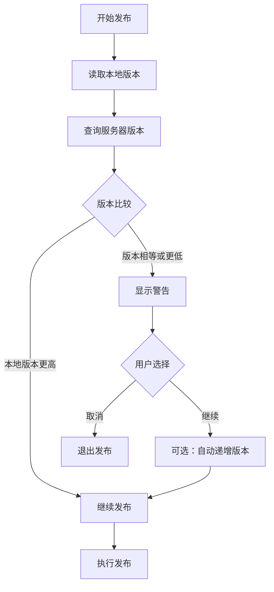

# VSCode-VSCE 自定义扩展市场实施计划

## 项目概述

将现有的 vscode-vsce 项目从微软扩展商店迁移到自定义扩展市场，支持以下核心功能：
- 自定义扩展市场 API 集成
- 版本验证与自动递增
- 本地测试服务器
- 向后兼容的命令行接口

## 系统架构

### 1. 自定义市场 API 规范

**API 端点：**
- `GET {baseUrl}/plugin/query?id={extensionId}&tag={releaseTag}` - 查询单个扩展信息，支持指定发布标签
- `GET {baseUrl}/plugin/search?tag={tags}` - 根据标签搜索扩展

**API 响应格式：**
```typescript
interface CustomExtension {
  id: string;
  name: string;
  version: string;
  publisher: string;
  displayName?: string;
  description?: string;
  tags?: string[];
  releaseTag?: 'stable' | 'alpha' | 'beta';
  lastUpdated: string;
}

interface QueryResponse {
  extension: CustomExtension | null;
}

interface SearchResponse {
  extensions: CustomExtension[];
  totalCount: number;
}
```

### 2. 目录结构

```
/root/vscode-vsce/
├── src/
│   ├── custom-marketplace-api.ts    # 新增：自定义市场API客户端
│   ├── version-validator.ts         # 新增：版本验证逻辑
│   ├── publish.ts                   # 修改：集成版本验证
│   └── publicgalleryapi.ts         # 保持：可选的微软API支持
├── test/
│   └── server/                      # 新增：本地测试服务器
│       ├── package.json
│       ├── server.js
│       └── mock-data.json
├── test-plugin/                     # 现有：用于功能验证
└── IMPLEMENTATION_PLAN.md           # 本文档
```

## 实施步骤

### 第一阶段：本地测试服务器 (Priority: High)

**目标：**建立本地测试环境，模拟自定义扩展市场

**任务：**
1. 创建 `test/server/` 目录结构
2. 实现 Node.js 测试服务器，监听端口 8991
3. 实现 `/plugin/query` 和 `/plugin/search` 端点
4. 创建模拟数据用于测试

**预计工时：**1-2 天

### 第二阶段：自定义市场API客户端 (Priority: High)

**目标：**替换现有的微软API调用

**任务：**
1. 创建 `custom-marketplace-api.ts`
2. 实现与现有 `PublicGalleryAPI` 兼容的接口
3. 支持配置自定义市场URL
4. 处理错误和重试逻辑

**预计工时：**2-3 天

### 第三阶段：版本验证系统 (Priority: Medium)

**目标：**发布前检查版本冲突

**任务：**
1. 创建 `version-validator.ts`
2. 在发布前查询服务器上的最新版本
3. 比较本地版本与服务器版本
4. 提供用户友好的版本冲突提示

**功能规范：**
```typescript
interface VersionValidationResult {
  isValid: boolean;
  serverVersion?: string;
  localVersion: string;
  message: string;
}
```

**预计工时：**1-2 天

### 第四阶段：自动版本递增 (Priority: Low)

**目标：**支持自动版本号管理

**任务：**
1. 扩展命令行参数：`vsce publish --auto-increment`
2. 实现语义化版本递增 (patch/minor/major)
3. 更新 package.json
4. 集成到发布流程

**命令示例：**
```bash
# 发布稳定版本
vsce publish --auto-increment patch  # 1.0.0 -> 1.0.1
vsce publish --auto-increment minor  # 1.0.0 -> 1.1.0
vsce publish --auto-increment major  # 1.0.0 -> 2.0.0

# 发布 alpha/beta 版本
vsce publish --tag alpha             # 发布 alpha 版本
vsce publish --tag beta              # 发布 beta 版本
vsce publish --tag alpha --auto-increment patch  # 自动递增并发布 alpha
```

**预计工时：**2-3 天

### 第五阶段：集成测试与验证 (Priority: High)

**目标：**确保所有功能正常工作

**任务：**
1. 使用 test-plugin 进行端到端测试
2. 验证版本检查逻辑
3. 测试自动版本递增
4. 性能测试和错误处理

**预计工时：**1-2 天

## 技术细节

### 配置管理

在 `package.json` 或单独的配置文件中支持：
```json
{
  "marketplace": {
    "type": "custom",
    "baseUrl": "http://your-server:8991",
    "apiVersion": "1.0"
  }
}
```

### 版本验证流程



### 向后兼容性

- 保留现有的微软市场支持
- 通过配置选择使用的市场类型
- 命令行参数保持不变
- API 接口保持兼容

## 测试策略

### 单元测试
- API 客户端功能测试
- 版本比较逻辑测试
- 配置解析测试

### 集成测试
- 本地服务器连接测试
- 完整发布流程测试
- 错误场景处理测试

### 端到端测试
- 使用 test-plugin 验证所有功能
- 模拟不同的版本冲突场景
- 测试自动版本递增功能

## 风险和缓解策略

### 技术风险
1. **API 兼容性问题**
   - 缓解：维护详细的API文档和测试用例
   - 实现渐进式迁移策略

2. **网络连接问题**
   - 缓解：实现重试机制和离线模式
   - 提供清晰的错误提示

### 用户体验风险
1. **学习成本**
   - 缓解：保持现有命令行接口不变
   - 提供详细的迁移指南

2. **配置复杂性**
   - 缓解：提供合理的默认值
   - 自动检测和配置助手

## 交付物

1. **源代码**
   - 修改后的 vscode-vsce 源码
   - 本地测试服务器代码

2. **文档**
   - API 文档
   - 用户迁移指南
   - 开发者文档

3. **测试套件**
   - 单元测试和集成测试
   - 测试数据和场景

4. **示例**
   - 配置示例
   - 使用示例

## 时间估算

- **总预计工时：**8-12 工作日
- **关键路径：**本地服务器 → API客户端 → 版本验证 → 集成测试
- **并行任务：**文档编写、测试用例开发

## 后续扩展

1. **缓存机制**：缓存API响应提升性能
2. **批量操作**：支持批量发布和版本管理
3. **Web界面**：为测试服务器添加管理界面
4. **插件系统**：支持自定义市场适配器
5. **监控集成**：添加发布成功率和性能监控

---

*此实施计划将确保项目能够顺利从微软扩展商店迁移到自定义市场，同时保持用户体验的连续性和代码的可维护性。*